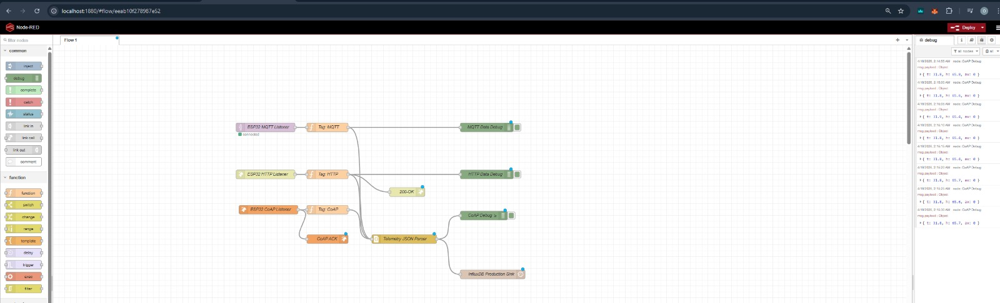
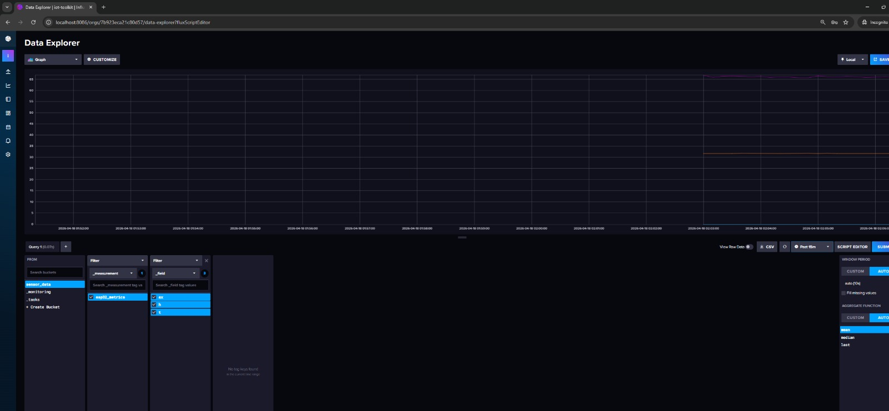

# Self-Hosted Server Setup

Set up your own MQTT broker, database, and dashboard.

### Architecture

The on-premise stack follows a centralized "Data Integration Hub" pattern, where Node-RED serves as the primary normalization layer for all incoming IoT data.

```
┌─────────────┐
│   ESP32     │──WiFi/UDP──┐
└─────────────┘            │ (CoAP/MQTT/HTTP)
                           ▼
                  ┌─────────────────┐
                  │  Docker Host    │
                  │  (Your Laptop)  │
                  └────────┬────────┘
                           │
             ┌─────────────┼─────────────┐
             ▼             ▼             ▼
        ┌────────┐   ┌────────┐   ┌──────────┐
        │Node-RED│   │InfluxDB│   │Mosquitto │
        │(Logic) │   │(TSDB)  │   │(Broker)  │
        └────────┘   └────────┘   └──────────┘
```

## Infrastructure Setup (Docker)

This is the fastest and most stable way to get your environment running. We have provided a pre-configured **IoT Toolkit Stack** that handles authentication and database setup automatically.

### 📋 Prerequisites
- **Docker Desktop** installed on Windows or Mac.
- **Git** to clone the repository.

### Step 1: Navigate to the Stack
Everything you need is located in the root of the repository:
[**onprem-docker/**](../../onprem-docker/)

### Step 2: Launch the Infrastructure
Open your terminal in the `onprem-docker` folder and run:
```bash
docker-compose up -d
```

> [!SUCCESS]
> **Zero-Touch Success!** The system will automatically create the database, set the admin password, and sync the security tokens between Node-RED and InfluxDB. You don't have to touch any configuration menus.

### 📊 Accessing Your Tools



| Tool | URL | Credentials |
| :--- | :--- | :--- |
| **Node-RED** | [http://localhost:1880](http://localhost:1880) | (None required) |
| **InfluxDB** | [http://localhost:8086](http://localhost:8086) | `admin` / `iotpassword123` |
| **MQTT Broker** | `localhost:1883` | (Anonymous allowed) |


### 🔐 Stability & Portability Secrets
Our stack uses two professional techniques to ensure it works on every student's machine:

1.  **Named Volumes**: We use `influxdb_data` (internal Linux volumes) instead of Windows folders. This prevents "Unauthorized" errors caused by Windows filesystem locking.
2.  **Environment Sync**: The Master Token (`iotmastertoken1234567890`) and `CREDENTIAL_SECRET` are shared across all containers automatically.

### 📁 Standardized Topic Structure
To keep your data organized, use this "Flat Measurement" pattern:

```
esp32/pub  -->  { "t": 25.5, "h": 60 }  --> InfluxDB (measurement: esp32_metrics)
```

---

---

## Configure ESP32

### Update MQTT Settings

```cpp
const char* mqtt_server = "raspberry-pi-ip-or-hostname";  // Or cloud VM IP
const int mqtt_port = 1883;
const char* mqtt_client_id = "iot-toolkit-001";

// Optional: Add authentication
const char* mqtt_user = "your-username";
const char* mqtt_pass = "your-password";

// In connection:
client.connect(mqtt_client_id, mqtt_user, mqtt_pass)
```

### Topic Structure

```
iot-toolkit/
├── data/           # Sensor readings
│   ├── temperature
│   ├── humidity
│   ├── vibration
│   └── acoustic
├── status/         # Device status
│   └── connection
└── commands/       # Remote commands
    └── config
```

## Data Pipeline



### Bridge MQTT to InfluxDB


Option 1: Telegraf
```bash
sudo apt install telegraf
```

Configure `/etc/telegraf/telegraf.conf`:
```toml
[[inputs.mqtt_consumer]]
  servers = ["tcp://localhost:1883"]
  topics = ["iot-toolkit/data"]
  data_format = "json"

[[outputs.influxdb_v2]]
  urls = ["http://localhost:8086"]
  token = "your-influxdb-token"
  organization = "iot-toolkit"
  bucket = "sensor-data"
```

Option 2: Python script
```python
import paho.mqtt.client as mqtt
from influxdb_client import InfluxDBClient, Point
from influxdb_client.client.write_api import SYNCHRONOUS

# InfluxDB setup
client = InfluxDBClient(url="http://localhost:8086", token="token")
write_api = client.write_api(write_options=SYNCHRONOUS)

# MQTT callback
def on_message(client, userdata, msg):
    data = json.loads(msg.payload)
    point = Point("sensors") \
        .tag("device", "iot-toolkit-001") \
        .field("temperature", data["temperature"]) \
        .field("humidity", data["humidity"])
    write_api.write(bucket="sensor-data", record=point)

mqtt_client = mqtt.Client()
mqtt_client.on_message = on_message
mqtt_client.connect("localhost", 1883)
mqtt_client.subscribe("iot-toolkit/data")
mqtt_client.loop_forever()
```

## Grafana Dashboard

### 1. Add InfluxDB Data Source

1. Login to Grafana
2. Configuration > Data Sources > Add
3. Select InfluxDB
4. URL: `http://influxdb:8086`
5. Organization: `iot-toolkit`
6. Token: Your InfluxDB token
7. Bucket: `sensor-data`

### 2. Create Dashboard

1. Create > Dashboard
2. Add Panel
3. Query: `from(bucket: "sensor-data") |> range(start: -1h) |> filter(fn: (r) => r._measurement == "sensors")`
4. Choose visualization (Graph, Gauge, etc.)
5. Save dashboard

### Sample Panels

- Temperature graph (time series)
- Humidity gauge (current value)
- Vibration heatmap
- Acoustic level bar chart
- Device status table

## Security

### Basic Authentication

```bash
# Create password file
sudo mosquitto_passwd -c /etc/mosquitto/passwd username

# Update config
sudo nano /etc/mosquitto/mosquitto.conf
# Add:
allow_anonymous false
password_file /etc/mosquitto/passwd

sudo systemctl restart mosquitto
```

### Firewall

```bash
# Allow MQTT
sudo ufw allow 1883/tcp
sudo ufw allow 8883/tcp  # For TLS

# Allow web interfaces
sudo ufw allow 8086/tcp  # InfluxDB
sudo ufw allow 3000/tcp  # Grafana

# Deny everything else
sudo ufw enable
```

### TLS/SSL (Production)

Use Let's Encrypt or self-signed certificates:

```bash
# Generate self-signed cert
openssl req -new -x509 -days 365 -nodes -out mosquitto.crt -keyout mosquitto.key

# Configure Mosquitto for TLS
listener 8883
certfile /etc/mosquitto/certs/mosquitto.crt
keyfile /etc/mosquitto/certs/mosquitto.key
```

## Maintenance

### Regular Tasks

| Task | Frequency | Command |
|------|-----------|---------|
| Update packages | Weekly | `sudo apt update && sudo apt upgrade` |
| Backup database | Daily | `influx backup` |
| Check logs | Daily | `sudo journalctl -u mosquitto` |
| Clean old data | Monthly | InfluxDB retention policy |

### Monitoring

Check services:
```bash
sudo systemctl status mosquitto
sudo systemctl status influxdb
sudo systemctl status grafana-server
```

## Troubleshooting

### Mosquitto Won't Start

```bash
# Check config
sudo mosquitto -c /etc/mosquitto/mosquitto.conf -v

# Check logs
sudo tail -f /var/log/mosquitto/mosquitto.log
```

### Can't Connect from ESP32

- Check firewall rules
- Verify port 1883 is open
- Check Mosquitto is listening: `sudo netstat -tlnp | grep 1883`

### No Data in InfluxDB

- Check Telegraf logs: `sudo journalctl -u telegraf`
- Verify MQTT topic subscription
- Check InfluxDB token

## Next Steps

- Configure [alerting in Grafana](https://grafana.com/docs/grafana/latest/alerting/)
- Set up [data retention policies](https://docs.influxdata.com/influxdb/v2.0/reference/influxql/retention-policies/)
- Add [more sensors](../hardware/sensors/index.md)
- Review [troubleshooting guide](../troubleshooting/index.md)
