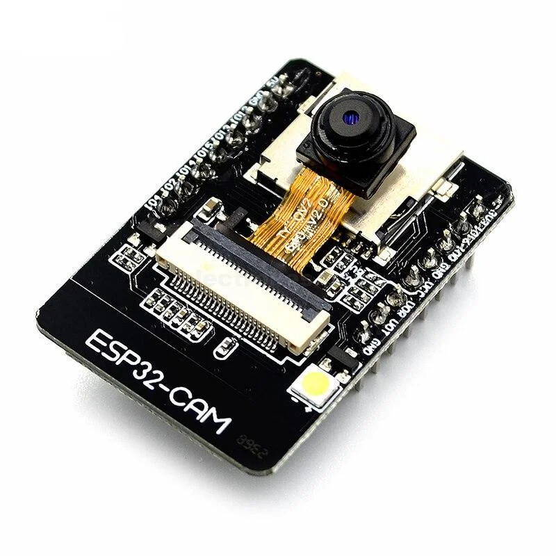

# Camera Module




<!-- TODO: Extract all content from Copy of IoT Kit - Tehqiq.md -->

## Overview

Camera module for image capture and visual monitoring.

## Specifications

| Parameter | Value |
|-----------|-------|
| Model | OV2640 or ESP32-CAM |
| Resolution | Up to 2MP (1600x1200) |
| Interface | Parallel (ESP32-CAM) or SPI |
| Operating Voltage | 3.3V |
| Features | JPEG compression, auto exposure, auto white balance |

## Pinout (ESP32-CAM)

| Pin | Function | ESP32 Connection |
|-----|----------|-----------------|
| 3.3V | Power | 3.3V |
| GND | Ground | GND |
| GPIO0 | Boot mode | Connect to GND for upload |
| GPIO1 | TX0 | Serial TX |
| GPIO3 | RX0 | Serial RX |
| GPIO4 | LED | Flash LED control |
| GPIO12 | HS2_DATA2 | SD Card |
| GPIO13 | HS2_DATA3 | SD Card |
| GPIO14 | HS2_CLK | SD Card |
| GPIO15 | HS2_CMD | SD Card |
| GPIO16 | PSRAM | External RAM |
| GPIO18 | HS1_CLK | Camera clock |
| GPIO19 | HS1_DATA2 | Camera data |
| GPIO21 | HS1_DATA0 | Camera data |
| GPIO22 | HS1_DATA1 | Camera data |
| GPIO23 | HS1_DATA3 | Camera data |
| GPIO25 | HS1_DATA4 | Camera data |
| GPIO26 | HS1_DATA5 | Camera data |
| GPIO27 | HS1_DATA6 | Camera data |
| GPIO32 | HS1_DATA7 | Camera data |
| GPIO33 | HS1_PCLK | Camera pixel clock |
| GPIO34 | HS1_VSYNC | Camera vertical sync |
| GPIO35 | HS1_HREF | Camera horizontal sync |
| GPIO39 | HS1_DATA8 | Camera data |

## Wiring Diagram

ESP32-CAM has fixed pin assignments. Use a dedicated ESP32-CAM board or module.

## Required Libraries

- ESP32 Camera library (included with ESP32 board support)

## Code Example

### Basic Camera Test

```cpp
#include "esp_camera.h"

// Camera pin definitions for ESP32-CAM
#define PWDN_GPIO_NUM     32
#define RESET_GPIO_NUM    -1
#define XCLK_GPIO_NUM      0
#define SIOD_GPIO_NUM     26
#define SIOC_GPIO_NUM     27

#define Y9_GPIO_NUM       35
#define Y8_GPIO_NUM       34
#define Y7_GPIO_NUM       39
#define Y6_GPIO_NUM       36
#define Y5_GPIO_NUM       21
#define Y4_GPIO_NUM       19
#define Y3_GPIO_NUM       18
#define Y2_GPIO_NUM        5
#define VSYNC_GPIO_NUM    25
#define HREF_GPIO_NUM     23
#define PCLK_GPIO_NUM     22
#define LED_GPIO_NUM       4

void setup() {
  Serial.begin(115200);
  Serial.setDebugOutput(true);
  Serial.println();
  
  camera_config_t config;
  config.ledc_channel = LEDC_CHANNEL_0;
  config.ledc_timer = LEDC_TIMER_0;
  config.pin_d0 = Y2_GPIO_NUM;
  config.pin_d1 = Y3_GPIO_NUM;
  config.pin_d2 = Y4_GPIO_NUM;
  config.pin_d3 = Y5_GPIO_NUM;
  config.pin_d4 = Y6_GPIO_NUM;
  config.pin_d5 = Y7_GPIO_NUM;
  config.pin_d6 = Y8_GPIO_NUM;
  config.pin_d7 = Y9_GPIO_NUM;
  config.pin_xclk = XCLK_GPIO_NUM;
  config.pin_pclk = PCLK_GPIO_NUM;
  config.pin_vsync = VSYNC_GPIO_NUM;
  config.pin_href = HREF_GPIO_NUM;
  config.pin_sscb_sda = SIOD_GPIO_NUM;
  config.pin_sscb_scl = SIOC_GPIO_NUM;
  config.pin_pwdn = PWDN_GPIO_NUM;
  config.pin_reset = RESET_GPIO_NUM;
  config.xclk_freq_hz = 20000000;
  config.pixel_format = PIXFORMAT_JPEG;
  
  // Init with high specs to pre-allocate larger buffers
  if(psramFound()){
    config.frame_size = FRAMESIZE_UXGA;
    config.jpeg_quality = 10;
    config.fb_count = 2;
  } else {
    config.frame_size = FRAMESIZE_SVGA;
    config.jpeg_quality = 12;
    config.fb_count = 1;
  }
  
  // Camera init
  esp_err_t err = esp_camera_init(&config);
  if (err != ESP_OK) {
    Serial.printf("Camera init failed with error 0x%x", err);
    return;
  }
  
  sensor_t * s = esp_camera_sensor_get();
  // Drop down frame size for higher initial frame rate
  s->set_framesize(s, FRAMESIZE_QVGA);
  
  Serial.println("Camera initialized");
}

void loop() {
  // TODO: Add capture and transmission code
  
  delay(5000);
}
```

## Testing

### Verification Steps

1. Connect ESP32-CAM module
2. Connect GPIO0 to GND for upload mode
3. Upload code
4. Disconnect GPIO0 from GND
5. Reset the module
6. Check Serial Monitor for initialization messages

## Troubleshooting

| Issue | Solution |
|-------|----------|
| Brownout error | Use separate 3.3V power supply or add capacitor |
| Camera init failed | Check PSRAM availability, verify connections |
| Poor image quality | Adjust frame size and JPEG quality settings |
| No image capture | Check PSRAM configuration |

## Next Steps

- Integrate with [cloud services](../../cloud/index.md) for remote monitoring
- Add motion detection to [integration](../../integration/index.md)
