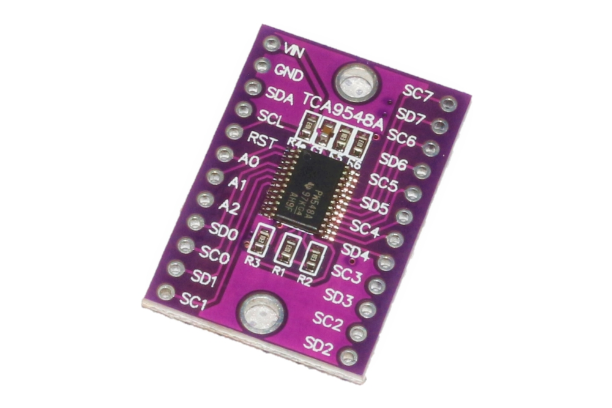

# I2C Multiplexer (TCA9548A)

<!-- TODO: Extract all content from Copy of IoT Kit - Tehqiq.md -->

## Overview

The TCA9548A I2C multiplexer allows multiple I2C devices with the same address to coexist on the same bus by creating 8 separate I2C channels.




## Specifications

| Parameter | Value |
|-----------|-------|
| Model | TCA9548A |
| Channels | 8 selectable I2C buses |
| Interface | I2C |
| Operating Voltage | 3.3V - 5V |
| I2C Address | 0x70 (default) |
| Switching | Individual channel control |

## Why Use a Multiplexer?

### Common Scenarios

1. **Same Address Sensors**: Multiple sensors of same type (e.g., two temperature sensors with address 0x48)
2. **Address Conflicts**: Two different sensors with identical factory addresses
3. **Bus Isolation**: Separate noisy devices from sensitive ones
4. **Debugging**: Isolate devices to troubleshoot

## Pinout

| Pin | Function | ESP32 Connection |
|-----|----------|-----------------|
| VCC | Power | 3.3V or 5V |
| GND | Ground | GND |
| SDA | I2C Data (master side) | GPIO21 |
| SCL | I2C Clock (master side) | GPIO22 |
| SD0-SD7 | Channel 0-7 Data | Connect to sensor SDA |
| SC0-SC7 | Channel 0-7 Clock | Connect to sensor SCL |

## Wiring Diagram

```
TCA9548A              ESP32               Sensors
--------              -----               -------
VCC        --------->  3.3V
GND        --------->  GND
SDA        --------->  GPIO21
SCL        --------->  GPIO22
SD0/SC0    --------------------------->  Sensor 1 (Channel 0)
SD1/SC1    --------------------------->  Sensor 2 (Channel 1)
SD2/SC2    --------------------------->  Sensor 3 (Channel 2)
...                                    ...
SD7/SC7    --------------------------->  Sensor 8 (Channel 7)
```

## Required Libraries

No special library required - uses standard Wire library.

## Code Example

### Basic Usage

```cpp
#include <Wire.h>

#define MULTIPLEXER_ADDR 0x70  // TCA9548A address

// Select channel (0-7)
void selectChannel(uint8_t channel) {
  if (channel > 7) return;
  
  Wire.beginTransmission(MULTIPLEXER_ADDR);
  Wire.write(1 << channel);
  Wire.endTransmission();
}

// Disable all channels
void disableAllChannels() {
  Wire.beginTransmission(MULTIPLEXER_ADDR);
  Wire.write(0);
  Wire.endTransmission();
}

void setup() {
  Wire.begin();
  Serial.begin(115200);
  
  Serial.println("TCA9548A Multiplexer Test");
  
  // Scan all channels
  for (uint8_t channel = 0; channel < 8; channel++) {
    selectChannel(channel);
    
    Serial.print("Channel ");
    Serial.print(channel);
    Serial.print(": ");
    
    // Scan for devices on this channel
    int deviceCount = 0;
    for (uint8_t address = 1; address < 127; address++) {
      Wire.beginTransmission(address);
      if (Wire.endTransmission() == 0) {
        Serial.print("0x");
        if (address < 16) Serial.print("0");
        Serial.print(address, HEX);
        Serial.print(" ");
        deviceCount++;
      }
    }
    
    if (deviceCount == 0) {
      Serial.print("No devices");
    }
    Serial.println();
  }
  
  disableAllChannels();
}

void loop() {
  // Example: Read from sensor on channel 0
  selectChannel(0);
  // TODO: Add sensor reading code
  
  // Read from sensor on channel 1
  selectChannel(1);
  // TODO: Add sensor reading code
  
  delay(1000);
}
```

### With Multiple Temperature Sensors

```cpp
#include <Wire.h>

#define MULTIPLEXER_ADDR 0x70

void selectChannel(uint8_t channel) {
  Wire.beginTransmission(MULTIPLEXER_ADDR);
  Wire.write(1 << channel);
  Wire.endTransmission();
}

float readTemperature(uint8_t channel) {
  selectChannel(channel);
  // TODO: Add actual sensor reading code
  return 25.0; // Placeholder
}

void setup() {
  Wire.begin();
  Serial.begin(115200);
}

void loop() {
  // Read from multiple sensors with same address
  float temp1 = readTemperature(0);  // Sensor 1 on channel 0
  float temp2 = readTemperature(1);  // Sensor 2 on channel 1
  float temp3 = readTemperature(2);  // Sensor 3 on channel 2
  
  Serial.print("Temp 1: ");
  Serial.print(temp1);
  Serial.print("°C, Temp 2: ");
  Serial.print(temp2);
  Serial.print("°C, Temp 3: ");
  Serial.print(temp3);
  Serial.println("°C");
  
  delay(2000);
}
```

## Address Configuration

The TCA9548A I2C address can be changed using the A0-A2 pins:

| A0 | A1 | A2 | Address |
|----|----|----|---------|
| GND | GND | GND | 0x70 |
| VCC | GND | GND | 0x71 |
| GND | VCC | GND | 0x72 |
| VCC | VCC | GND | 0x73 |
| GND | GND | VCC | 0x74 |
| VCC | GND | VCC | 0x75 |
| GND | VCC | VCC | 0x76 |
| VCC | VCC | VCC | 0x77 |

## Testing

### Verification Steps

1. Connect multiplexer and one sensor
2. Upload channel scanner code
3. Verify sensor detected on selected channel only
4. Test multiple sensors on different channels

## Troubleshooting

| Issue | Solution |
|-------|----------|
| No devices detected | Check multiplexer address, verify channel selection |
| All channels show same device | Device connected to main bus instead of channel |
| Intermittent connections | Check wiring, ensure good connections |
| Device not responding | Verify correct channel selected before communication |

## Best Practices

1. Always select channel before I2C communication
2. Disable channels when not in use (optional)
3. Keep I2C wires short (< 30cm per segment)
4. Use pull-up resistors (4.7kΩ) if needed

## Next Steps

- Connect multiple [sensors](../sensors/index.md) with same address
- Proceed to [full integration](../../integration/index.md)
