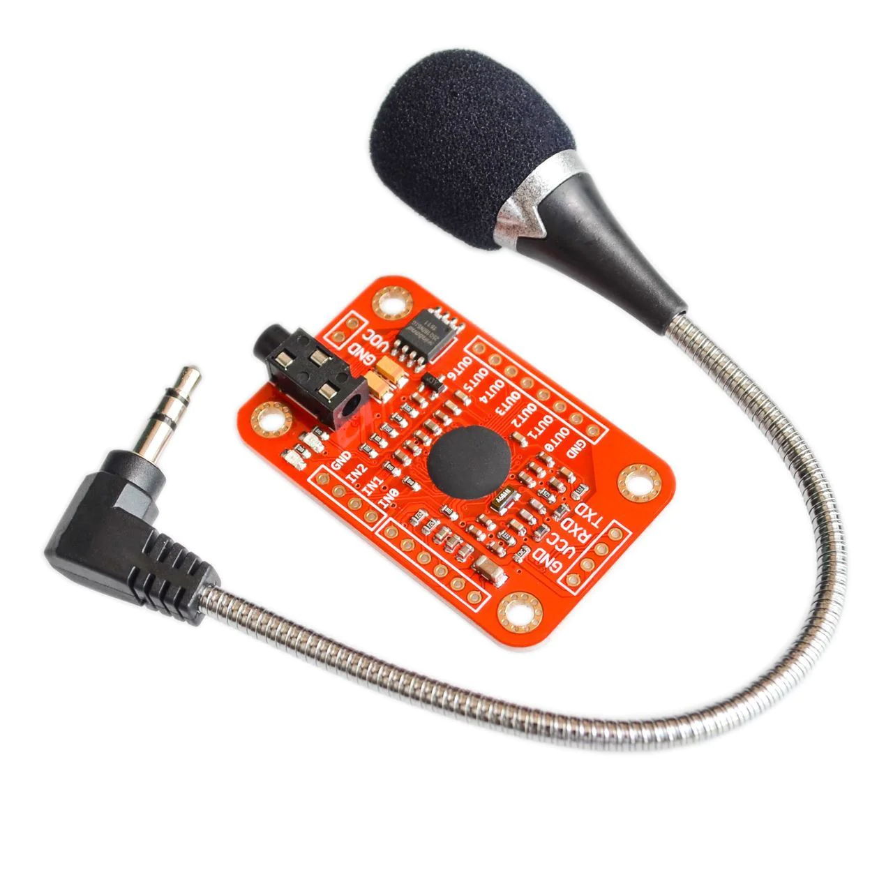

# Voice Recognition Module

The toolkit uses an advanced **Voice Recognition Module** (e.g., Elechouse V3) for audio recognition and refined command control. This module can be trained to recognize custom voice commands.



!!! warning "Voltage Level Shifting"
    The Voice Recognition Module typically operates at **5V**, but the ESP32 GPIO pins are **3.3V**. You **must** use a voltage divider (resistors) or a level shifter on the module's TX pin before connecting it to the ESP32 RX pin to avoid damaging your board.

## Specifications

| Parameter | Value |
|-----------|-------|
| Model | Elechouse Voice Recognition V3 |
| Interface | UART (Serial) |
| Voltage | 4.5V - 5.5V |
| Recognition | Up to 80 commands (7 active) |
| Accuracy | >90% (trained) |

## Pinout

| Pin | Function | ESP32 Connection |
|-----|----------|-----------------|
| VCC | Power | 5V / VIN |
| GND | Ground | GND |
| TX | Data Output | RX2 (GPIO16) *via Level Shifter* |
| RX | Data Input | TX2 (GPIO17) |

## Code Example

```cpp
// Voice Recognition Module UART Test
#include <SoftwareSerial.h>
#include "VoiceRecognitionV3.h"

/**
  Connection:
  ESP32 RX2 (GPIO16) <--- Level Shifter <--- Module TX
  ESP32 TX2 (GPIO17) ---> Module RX
*/

VR myVR(16, 17);    // RX, TX

void setup() {
  Serial.begin(115200);
  myVR.begin(9600);
  
  if(myVR.clear() == 0){
    Serial.println("VR Module Cleared.");
  }else{
    Serial.println("VR Module not found.");
  }
}

void loop() {
  int ret = myVR.recognize(buf, 50);
  if(ret>0){
    Serial.print("Recognized: ");
    Serial.println(ret);
  }
}
```

## Troubleshooting

| Issue | Solution |
|-------|----------|
| Module not found | Check UART pins, verify 5V power supply |
| No command recognized | Ensure commands are trained, check ambient noise |
| ESP32 crashes | Verify voltage level shifter on TX pin |

## Next Steps

- Integrate with [Integration Overview](../../integration/index.md)
