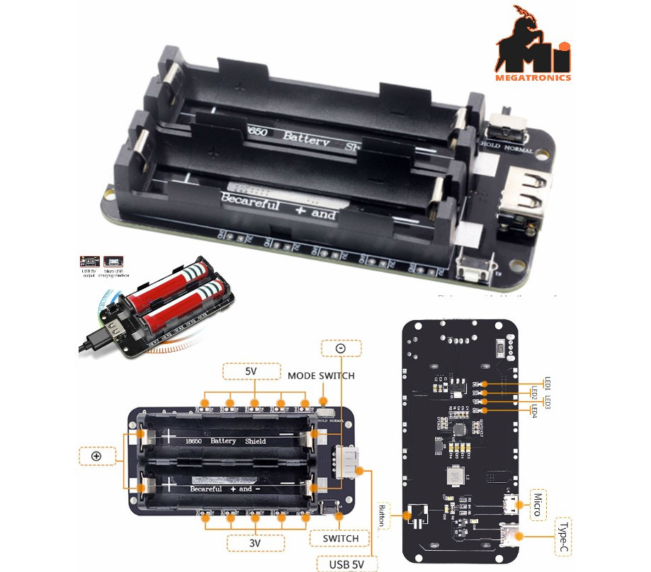

# Power Source: Dual 18650 Battery Shield

For deployments in remote locations without external power, the IoT Toolkit uses a **Dual 18650 Lithium Battery Shield**. This module provides stable 3.3V and 5V power rails directly from rechargeable lithium cells.

> [!CAUTION]
> **Polarity Warning**: These modules rarely have reverse polarity protection. Inserting a battery backward will permanently damage the shield and potentially cause a fire hazard. Always match the **+** and **-** markings on the PCB with your batteries.

## Specifications

| Parameter | Value |
|-----------|-------|
| Battery Type | 18650 Li-ion (3.7V nominal) |
| Output Voltages | 5V (USB-A & Pins) and 3.3V (Pins) |
| 5V Current | Up to 2.2A (3A peak) |
| 3.3V Current | Up to 1A |
| Charging Port | Micro-USB / USB-C (5V Input) |
| Protection | Over-charge, Over-discharge, Over-current |

## Key Features

- **Integrated Charging**: Charge your 18650 cells directly through the onboard USB port without removing them.
- **Dual Outputs**: Simultaneously power the ESP32 (via 5V or 3.3V) and external peripherals like high-power sensors or 5V displays.
- **Status LEDs**: Onboard indicators show battery charge level and charging status.
- **Power Switch**: Includes a physical toggle switch to turn the entire system on or off without disconnecting wires.

## Wiring to ESP32

To power your ESP32 from the shield:

1. Connect the **5V** pin of the shield to the **VIN** pin of the ESP32.
2. Connect the **GND** pin of the shield to the **GND** pin of the ESP32.
3. Alternatively, you can use a USB cable from the shield's USB-A port to the ESP32's USB port.

> [!TIP]
> Use high-quality 18650 cells (e.g., Panasonic, Samsung, LG) to ensure maximum runtime and safety during long-term field deployment.

## Next Steps

- Proceed to [Hardware Assembly](../getting-started/assembly-guide.md)
- Configure [Power Management Strategies](../../integration/index.md)
