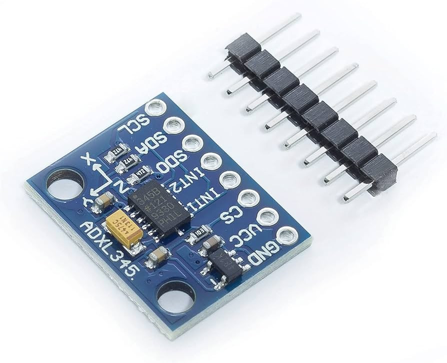

# ADXL335 (Analog Accelerometer)

The **ADXL335** is a small, thin, low power, complete 3-axis accelerometer with signal conditioned voltage outputs. It measures acceleration with a full-scale range of ±3 g.



## Features

- **Analog Interface**: Outputs voltage directly proportional to acceleration on X, Y, and Z axes.
- **Easy to Interface**: Can be connected directly to the ESP32's ADC (Analog-to-Digital Converter) pins.
- **Low Power**: Ideal for battery-powered environmental monitoring.

## Specifications

| Parameter | Value |
|-----------|-------|
| Axes | 3-axis (X, Y, Z) |
| Output | Analog Voltage |
| Sensitivity | 300 mV/g (typical) |
| Range | ±3g |
| Operating Voltage | 1.8V - 3.6V (3.3V Recommended) |

## Pinout

| Pin | Function | ESP32 Connection |
|-----|----------|-----------------|
| VCC | Power | 3.3V |
| GND | Ground | GND |
| X | X-axis analog out | GPIO32 (ADC1) |
| Y | Y-axis analog out | GPIO33 (ADC1) |
| Z | Z-axis analog out | GPIO34 (ADC1) |

## Code Example

```cpp
const int xPin = 32;
const int yPin = 33;
const int zPin = 34;

void setup() {
  Serial.begin(115200);
}

void loop() {
  int xRaw = analogRead(xPin);
  int yRaw = analogRead(yPin);
  int zRaw = analogRead(zPin);

  Serial.printf("X: %d | Y: %d | Z: %d\n", xRaw, yRaw, zRaw);
  delay(200);
}
```

## Troubleshooting

| Issue | Solution |
|-------|----------|
| Noisy readings | Add a 0.1μF capacitor between each output pin and GND. |
| Values don't change | Check if the correct ADC pins are used; verify 3.3V power. |
| Constant max/min values | Ensure the ESP32 and sensor share a common ground. |
