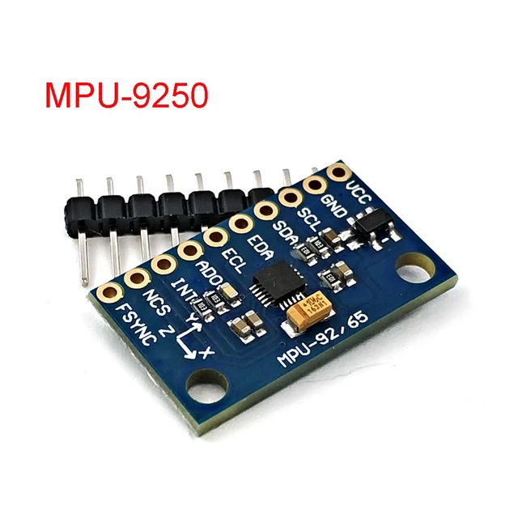

# MPU6050 (Digital Accelerometer & Gyro)

The **MPU6050** is a serious piece of motion-tracking technology. It combines a 3-axis gyroscope and a 3-axis accelerometer on the same silicon die, together with an onboard Digital Motion Processor (DMP).



## Why use MPU6050?

- **Digital Interface**: Uses I2C, allowing it to share the bus with other sensors like the DHT or LCD.
- **High Precision**: Provides 16-bit resolution for each axis.
- **Integrated Gyroscope**: In addition to vibration (acceleration), it can measure rotational movement and orientation.

## Specifications

| Parameter | Value |
|-----------|-------|
| Axes | 6-axis (3 Accel, 3 Gyro) |
| Interface | I2C |
| Accel Range | ±2, ±4, ±8, ±16g |
| Gyro Range | ±250, 500, 1000, 2000 °/s |
| Voltage | 3V - 5V |

## Pinout

| Pin | Function | ESP32 Connection |
|-----|----------|-----------------|
| VCC | Power | 3.3V |
| GND | Ground | GND |
| SCL | I2C Clock | GPIO22 |
| SDA | I2C Data | GPIO21 |
| AD0 | I2C Address Select | GND (Address 0x68) |

## Code Example

```cpp
#include <Adafruit_MPU6050.h>
#include <Adafruit_Sensor.h>
#include <Wire.h>

Adafruit_MPU6050 mpu;

void setup() {
  Serial.begin(115200);
  if (!mpu.begin()) {
    Serial.println("Failed to find MPU6050 chip");
    while (1) { delay(10); }
  }
}

void loop() {
  sensors_event_t a, g, temp;
  mpu.getEvent(&a, &g, &temp);

  Serial.print("Accel X: "); Serial.print(a.acceleration.x);
  Serial.print(" m/s^2, Y: "); Serial.print(a.acceleration.y);
  Serial.print(" m/s^2, Z: "); Serial.print(a.acceleration.z);
  Serial.println(" m/s^2");

  delay(500);
}
```

## Troubleshooting

| Issue | Solution |
|-------|----------|
| "Failed to find chip" | Verify I2C wiring (SDA/SCL) and ensure the module is powered. |
| Readings are static | Ensure the module is not being held in a fixed orientation during test. |
| I2C Address conflict | The default address is 0x68. Pull AD0 pin High to change to 0x69. |
