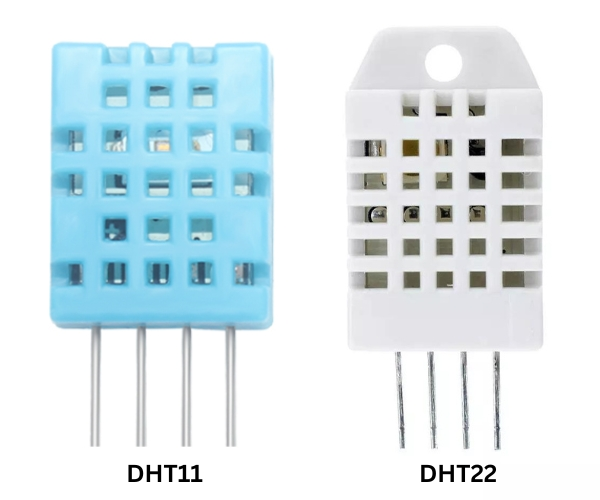

# Temperature Sensor

<!-- TODO: Extract all content from Copy of IoT Kit - Tehqiq.md -->

## Overview

The temperature and humidity sensors in this toolkit are combined into a single **DHT (Digital Humidity and Temperature)** sensor module. This means a single physical component provides both sets of data.



## DHT Versions

There are two common versions of this sensor included in many kits: **DHT11** (usually blue) and **DHT22** (usually white). While they look similar and use the same pinout, they have different numerical configurations:

| Feature | DHT11 (Blue) | DHT22 (White) |
|---------|--------------|---------------|
| **Temperature Range** | 0°C to 50°C | -40°C to 80°C |
| **Temperature Accuracy** | ±2.0°C | ±0.5°C |
| **Humidity Range** | 20% to 80% | 0% to 100% |
| **Humidity Accuracy** | ±5% | ±2-5% |
| **Sampling Rate** | 1 Hz (1 reading/sec) | 0.5 Hz (1 reading/2 sec) |

## Specifications

| Parameter | Value |
|-----------|-------|
| Model | DHT11 / DHT22 |
| Interface | Single-bus Digital |
| Operating Voltage | 3.3V - 5V |


## Pinout

<!-- TODO: Add pinout diagram from source -->

| Pin | Function | ESP32 Connection |
|-----|----------|-----------------|
| VCC | Power | 3.3V |
| GND | Ground | GND |
| SDA | I2C Data | GPIO21 |
| SCL | I2C Clock | GPIO22 |

## Wiring Diagram

<!-- TODO: Add wiring diagram -->

```
Temperature Sensor
       |
       |-- VCC --> 3.3V
       |-- GND --> GND
       |-- SDA --> GPIO21
       |-- SCL --> GPIO22
```

## Code Example

<!-- TODO: Extract test code from source file -->

```cpp
// Temperature Sensor Test Code
// TODO: Add actual code from source file

#include <Wire.h>

void setup() {
  Serial.begin(115200);
  Wire.begin();
  
  // TODO: Add sensor initialization
}

void loop() {
  // TODO: Add sensor reading code
  
  delay(1000);
}
```

## Required Libraries

<!-- TODO: Add library names from source -->

| Library | Version | Purpose |
|---------|---------|---------|
| <!-- TODO: Add --> | <!-- TODO: Add --> | <!-- TODO: Add --> |

## Testing

### Verification Steps

1. Upload code to ESP32
2. Open Serial Monitor (115200 baud)
3. Expected output:
   ```
   <!-- TODO: Add expected output from source -->
   ```

## Troubleshooting

| Issue | Solution |
|-------|----------|
| Sensor not detected | Check I2C address, verify wiring |
| Readings unstable | Check power supply, add pull-up resistors |
| <!-- TODO: Add --> | <!-- TODO: Add --> |

## Next Steps

- Test [Humidity Sensor](humidity.md)
- Proceed to [full integration](../../integration/index.md)
