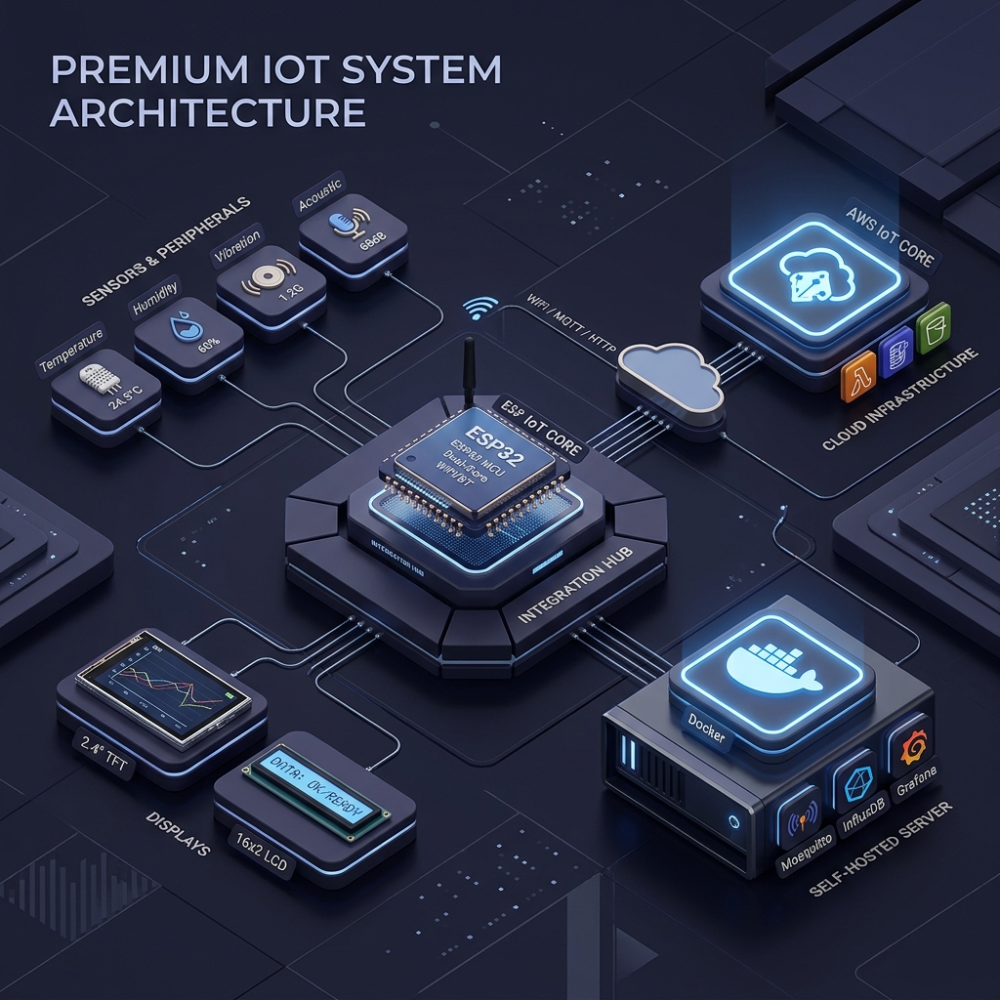

# IoT Toolkit Manual

## What You'll Learn

This guide will walk you through:

- **[Hardware Assembly](getting-started/assembly-guide.md)**: Connect ESP32 with temperature, humidity, vibration, and acoustic sensors
- **[Display Integration](hardware/displays/index.md)**: Set up LCD and TFT displays for data visualization
- **[Module Configuration](hardware/modules/index.md)**: Configure I2C multiplexer, voice module, and camera module
- **[Communication](hardware/communication/index.md)**: Use WiFi with MQTT, HTTP, and CoAP protocols
- **[Cloud Deployment](cloud/index.md)**: Connect to AWS IoT Core or set up your own server
- **[Troubleshooting](troubleshooting/index.md)**: Solve common hardware and software issues

A student-friendly guide for building and configuring IoT systems with ESP32, sensors, displays, and cloud connectivity.

!!! tip "Jump to the Full System"
    If you have all your hardware components connected and just want the firmware to get started, go directly to the [**Complete Integration Code**](integration/complete-code.md).

## Core Components

- **ESP32**: WiFi-enabled microcontroller
- **Sensors**: Temperature, Humidity, Vibration, Acoustic
- **Displays**: LCD and TFT for local data display
- **Modules**: I2C multiplexer, Voice module, Camera module

### Communication
- **WiFi**: Built into ESP32
- **Protocols**: MQTT, HTTP, CoAP

## Cloud Options

Choose your preferred cloud deployment method:

-   :material-cloud: **AWS IoT Core**

    ---

    Managed cloud service with built-in security and scalability

    [Learn more](cloud/aws.md)

-   :material-server: **Self-Hosted Server**

    ---

    Full control with MQTT broker on your own server

    [Learn more](cloud/self-hosted.md)

## Need Help?

- Check the [Troubleshooting](troubleshooting/index.md) section
- Review the [Glossary](resources/glossary.md) for terms and definitions
- Visit our [GitHub repository](https://github.com/OmerRastgar/IoT-Toolkit-Manual)

---

**Let's build something amazing!** :material-rocket-launch:
