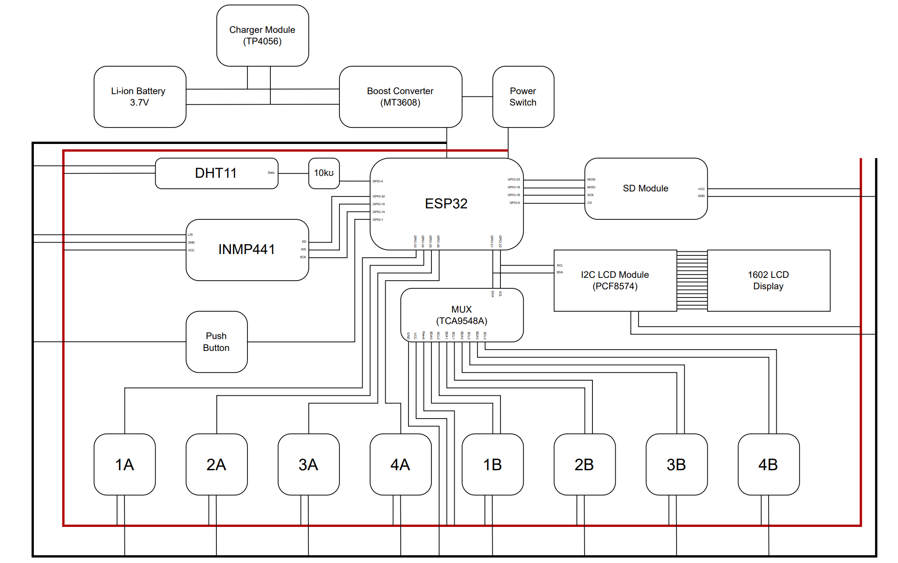

# Complete Integration Code

Full system code combining all components.



## Overview

This code integrates:
- All sensors (temperature, humidity, vibration, acoustic)
- LCD and TFT displays
- WiFi connectivity
- MQTT cloud transmission
- Error handling

## Required Libraries

```cpp
#include <WiFi.h>
#include <Wire.h>
#include <PubSubClient.h>
#include <ArduinoJson.h>
#include <LiquidCrystal_I2C.h>

// TODO: Add sensor-specific libraries
```

## Configuration

```cpp
// ============== CONFIGURATION ==============

// WiFi Settings
const char* ssid = "YOUR_WIFI_SSID";
const char* password = "YOUR_WIFI_PASSWORD";

// MQTT Settings
const char* mqtt_server = "broker.hivemq.com";  // Change to your broker
const int mqtt_port = 1883;
const char* mqtt_client_id = "iot-toolkit-001";

// Pin Definitions
#define LCD_ADDRESS 0x27
#define LCD_COLUMNS 16
#define LCD_ROWS 2

// Timing
const unsigned long SENSOR_INTERVAL = 5000;   // Read sensors every 5s
const unsigned long DISPLAY_INTERVAL = 1000;  // Update display every 1s
const unsigned long MQTT_INTERVAL = 10000;    // Send MQTT every 10s

// ============== GLOBAL VARIABLES ==============
```

## Complete Sketch

```cpp
/*
 * IoT Toolkit - Complete Integration
 * 
 * Features:
 * - Read all sensors (temperature, humidity, vibration, acoustic)
 * - Display on LCD
 * - Send data via MQTT
 * - WiFi connectivity with auto-reconnect
 */

#include <WiFi.h>
#include <Wire.h>
#include <PubSubClient.h>
#include <ArduinoJson.h>
#include <LiquidCrystal_I2C.h>

// ============== CONFIGURATION ==============

const char* ssid = "YOUR_WIFI_SSID";
const char* password = "YOUR_WIFI_PASSWORD";

const char* mqtt_server = "broker.hivemq.com";
const int mqtt_port = 1883;

// ============== GLOBAL OBJECTS ==============

WiFiClient espClient;
PubSubClient mqttClient(espClient);
LiquidCrystal_I2C lcd(0x27, 16, 2);

// ============== GLOBAL VARIABLES ==============

// Sensor data
float temperature = 0.0;
float humidity = 0.0;
float vibration = 0.0;
float acoustic = 0.0;

// Timestamps
unsigned long lastSensorRead = 0;
unsigned long lastDisplayUpdate = 0;
unsigned long lastMQTTSend = 0;

// System state
bool wifiConnected = false;
bool mqttConnected = false;
int readCount = 0;

// ============== SETUP ==============

void setup() {
  Serial.begin(115200);
  Serial.println("\n========================================");
  Serial.println("IoT Toolkit - Complete Integration");
  Serial.println("========================================\n");
  
  // Initialize LCD
  lcd.init();
  lcd.backlight();
  lcd.setCursor(0, 0);
  lcd.print("IoT Toolkit");
  lcd.setCursor(0, 1);
  lcd.print("Starting...");
  
  // Initialize Wire (I2C)
  Wire.begin();
  Serial.println("I2C initialized");
  
  // TODO: Initialize sensors
  // initializeSensors();
  
  // Connect WiFi
  connectWiFi();
  
  // Setup MQTT
  mqttClient.setServer(mqtt_server, mqtt_port);
  mqttClient.setCallback(mqttCallback);
  
  Serial.println("\nSetup complete. Starting main loop...\n");
  lcd.clear();
  lcd.setCursor(0, 0);
  lcd.print("Ready!");
}

// ============== MAIN LOOP ==============

void loop() {
  // Handle WiFi connection
  if (WiFi.status() != WL_CONNECTED) {
    connectWiFi();
  }
  
  // Handle MQTT connection
  if (!mqttClient.connected()) {
    connectMQTT();
  }
  mqttClient.loop();
  
  // Read sensors periodically
  if (millis() - lastSensorRead >= SENSOR_INTERVAL) {
    readSensors();
    lastSensorRead = millis();
  }
  
  // Update display periodically
  if (millis() - lastDisplayUpdate >= DISPLAY_INTERVAL) {
    updateDisplay();
    lastDisplayUpdate = millis();
  }
  
  // Send MQTT data periodically
  if (millis() - lastMQTTSend >= MQTT_INTERVAL) {
    sendMQTTData();
    lastMQTTSend = millis();
  }
}

// ============== WIFI FUNCTIONS ==============

void connectWiFi() {
  if (WiFi.status() == WL_CONNECTED) return;
  
  Serial.print("Connecting to WiFi");
  lcd.clear();
  lcd.setCursor(0, 0);
  lcd.print("WiFi...");
  
  WiFi.mode(WIFI_STA);
  WiFi.begin(ssid, password);
  
  int attempts = 0;
  while (WiFi.status() != WL_CONNECTED && attempts < 20) {
    delay(500);
    Serial.print(".");
    attempts++;
  }
  
  if (WiFi.status() == WL_CONNECTED) {
    Serial.println("\nWiFi connected!");
    Serial.print("IP: ");
    Serial.println(WiFi.localIP());
    wifiConnected = true;
    
    lcd.clear();
    lcd.setCursor(0, 0);
    lcd.print("WiFi OK");
    lcd.setCursor(0, 1);
    lcd.print(WiFi.localIP().toString().substring(0, 14));
    delay(2000);
  } else {
    Serial.println("\nWiFi connection failed!");
    wifiConnected = false;
    lcd.clear();
    lcd.setCursor(0, 0);
    lcd.print("WiFi Failed!");
    delay(2000);
  }
}

// ============== MQTT FUNCTIONS ==============

void connectMQTT() {
  while (!mqttClient.connected()) {
    Serial.print("MQTT connecting...");
    lcd.clear();
    lcd.setCursor(0, 0);
    lcd.print("MQTT...");
    
    String clientId = String(mqtt_client_id) + "-" + String(random(0xffff), HEX);
    
    if (mqttClient.connect(clientId.c_str())) {
      Serial.println("connected");
      mqttConnected = true;
      
      // Subscribe to command topic
      mqttClient.subscribe("iot-toolkit/commands");
      
      lcd.clear();
      lcd.setCursor(0, 0);
      lcd.print("MQTT OK");
      delay(1000);
    } else {
      Serial.print("failed, rc=");
      Serial.println(mqttClient.state());
      mqttConnected = false;
      
      lcd.clear();
      lcd.setCursor(0, 0);
      lcd.print("MQTT Failed!");
      delay(2000);
    }
  }
}

void mqttCallback(char* topic, byte* payload, unsigned int length) {
  Serial.print("MQTT message [");
  Serial.print(topic);
  Serial.print("]: ");
  
  for (int i = 0; i < length; i++) {
    Serial.print((char)payload[i]);
  }
  Serial.println();
  
  // TODO: Handle commands
}

void sendMQTTData() {
  if (!mqttClient.connected()) {
    Serial.println("MQTT not connected, skipping send");
    return;
  }
  
  StaticJsonDocument<512> doc;
  
  doc["device_id"] = mqtt_client_id;
  doc["timestamp"] = millis();
  doc["readings"] = readCount;
  
  JsonObject sensors = doc.createNestedObject("sensors");
  sensors["temperature"] = temperature;
  sensors["humidity"] = humidity;
  sensors["vibration"] = vibration;
  sensors["acoustic"] = acoustic;
  
  JsonObject system = doc.createNestedObject("system");
  system["wifi_rssi"] = WiFi.RSSI();
  system["free_heap"] = ESP.getFreeHeap();
  
  char payload[512];
  size_t len = serializeJson(doc, payload);
  
  Serial.print("Sending MQTT: ");
  Serial.println(payload);
  
  bool published = mqttClient.publish("iot-toolkit/data", payload);
  
  if (published) {
    Serial.println("MQTT publish successful");
  } else {
    Serial.println("MQTT publish failed");
  }
}

// ============== SENSOR FUNCTIONS ==============

void readSensors() {
  Serial.println("Reading sensors...");
  
  // TODO: Add actual sensor reading code
  // These are placeholder values - replace with real sensor readings
  
  temperature = 25.0 + random(-10, 10) / 10.0;  // 20.0 - 30.0
  humidity = 50.0 + random(-20, 20);             // 30 - 70
  vibration = random(0, 100);                     // 0 - 100
  acoustic = random(30, 90);                     // 30 - 90 dB
  
  readCount++;
  
  Serial.print("Temp: ");
  Serial.print(temperature);
  Serial.print("C, Hum: ");
  Serial.print(humidity);
  Serial.print("%, Vib: ");
  Serial.print(vibration);
  Serial.print", Acoustic: ");
  Serial.print(acoustic);
  Serial.println("dB");
}

// ============== DISPLAY FUNCTIONS ==============

void updateDisplay() {
  // Alternate between different display modes
  static int displayMode = 0;
  
  lcd.clear();
  
  switch (displayMode) {
    case 0:
      // Show temperature and humidity
      lcd.setCursor(0, 0);
      lcd.print("T:");
      lcd.print(temperature, 1);
      lcd.print((char)223); // Degree symbol
      lcd.print("C");
      
      lcd.setCursor(0, 1);
      lcd.print("H:");
      lcd.print(humidity, 0);
      lcd.print("%");
      break;
      
    case 1:
      // Show vibration and acoustic
      lcd.setCursor(0, 0);
      lcd.print("Vib:");
      lcd.print(vibration, 0);
      
      lcd.setCursor(0, 1);
      lcd.print("Snd:");
      lcd.print(acoustic, 0);
      lcd.print("dB");
      break;
      
    case 2:
      // Show WiFi and system status
      lcd.setCursor(0, 0);
      lcd.print("WiFi:");
      lcd.print(WiFi.RSSI());
      lcd.print("dBm");
      
      lcd.setCursor(0, 1);
      lcd.print("Reads:");
      lcd.print(readCount);
      break;
  }
  
  displayMode = (displayMode + 1) % 3;  // Cycle through 3 modes
}

// ============== UTILITY FUNCTIONS ==============

// TODO: Add any utility functions
```

## Code Structure

### Setup Phase
1. Initialize Serial
2. Initialize I2C
3. Initialize sensors
4. Connect WiFi
5. Setup MQTT

### Main Loop
1. Check WiFi connection
2. Check MQTT connection
3. Read sensors (every 5s)
4. Update display (every 1s)
5. Send MQTT data (every 10s)

### Functions
- `connectWiFi()` - WiFi connection with retry
- `connectMQTT()` - MQTT connection with retry
- `readSensors()` - Read all sensor values
- `updateDisplay()` - Update LCD with current values
- `sendMQTTData()` - Publish sensor data via MQTT

## Customization

### Change Intervals

```cpp
const unsigned long SENSOR_INTERVAL = 5000;   // 5 seconds
const unsigned long DISPLAY_INTERVAL = 1000;    // 1 second
const unsigned long MQTT_INTERVAL = 10000;      // 10 seconds
```

### Add More Sensors

1. Add sensor variable
2. Initialize in `setup()`
3. Read in `readSensors()`
4. Add to MQTT payload

### Change Topics

```cpp
mqttClient.publish("your/custom/topic", payload);
```

## Testing

See [Testing](testing.md) for verification procedures.

## Next Steps

- [Testing Procedures](testing.md)
- [Cloud Configuration](../cloud/index.md)
- [Troubleshooting](../troubleshooting/index.md)
