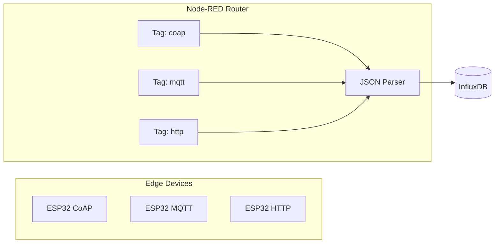

# Node-RED Smart Router


The Node-RED engine in this toolkit acts as a **Smart Protocol Router**. It receives data from multiple sources, normalizes it, and sends it to the database with appropriate metadata tags.

## Architecture



## How It Works

### 1. Unified Ingestion
Instead of having multiple separate paths to the database, every protocol feeds into the same **Telemetry JSON Parser**. This ensures your data always looks identical when it reaches InfluxDB, regardless of how it was sent.

### 2. Protocol Tagging
Each input node is followed by a **Metadata Tagger**. This adds a property to the message (e.g., `msg.protocol = 'coap'`).
- In InfluxDB, this becomes a **Tag**.
- You can use this tag to filter your graphs (e.g., "Show me only MQTT data").

### 3. Zero-Touch Authentication
The database configuration node is pre-programmed with environment variables:
- **Token**: `${INFLUX_TOKEN}`
- **Organization**: `${INFLUX_ORG}`
- **Bucket**: `${INFLUX_BUCKET}`

> [!SUCCESS]
> **One-Step Extension**: To add a new sensor or protocol, just drag a new input node and connect it to the **Telemetry JSON Parser**. It will inherit all database settings automatically!

## Adding a New Input

If you want to add a new protocol (like a Webhook or a different MQTT topic):

1.  Drag your **Input Node** (e.g., `mqtt in`) onto the canvas.
2.  Add a **Function Node** after it with this code:
    ```javascript
    msg.protocol = 'your-protocol-name';
    return msg;
    ```
3.  Connect the output to the **Telemetry JSON Parser** node.
4.  **Deploy**. Your data will now flow into InfluxDB with the new tag.

## Visualizing Tags in InfluxDB

In the InfluxDB Data Explorer, you will find a filter called `protocol`. If you select `mqtt`, the graph will update to show only data points that arrived via the MQTT protocol.

---
